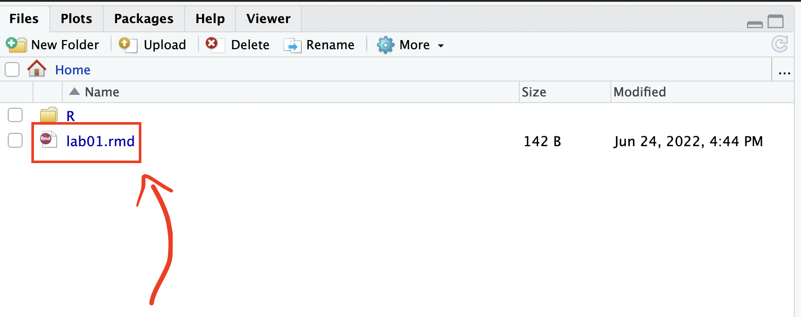

```{r emo-pkg, include=F}
library(emo)
```

The goal of this lab is to acquaint you with RStudio as well as the `R` computing environment. 


## Getting started

1. Download the lab template by pasting the code below in your **console**:

```
download.file("https://sta101.github.io/static/labs/lab01_template.Rmd", destfile = "lab01.rmd")
```

2. Under the "Files" tab on the right hand side, click on `lab01.rmd` to open the lab template.


3. Complete the exercises below using the space provided.


## Warm up

### YAML

The top portion of your R Markdown file (between the three dashed lines) is called YAML. It stands for "YAML Ain't Markup Language". It is a human friendly data serialization standard for all programming languages. All you need to know is that this area is called the YAML (we will refer to it as such) and that it contains meta information about your document.

Change the `author` name to your name and update the `date` with today's date. Click the yarn `r emo::ji("knit")` to knit the document. What do you notice?

**Note**: if you click the drop-down button next to "knit", you'll find that you can either create an HTML or PDF output file. Try both. In this course, all assignments **must be submitted to gradescope as PDFs**. 

**Note 2**: to avoid issues that can occur while knitting, it is a good idea to knit frequently. **At least after every exercise**.

### Packages

In this lab we will work with two packages: `datasauRus` which contains the dataset, and `tidyverse` which is a collection of packages for doing data analysis in a "tidy" way.

If you are using `R` on the container, packages we are using should already be installed and only need to be loaded.

```{r load-packages, warning=F, message=F}
library(tidyverse) 
library(datasauRus)
```


## Formatting

## Submitting to gradescope


